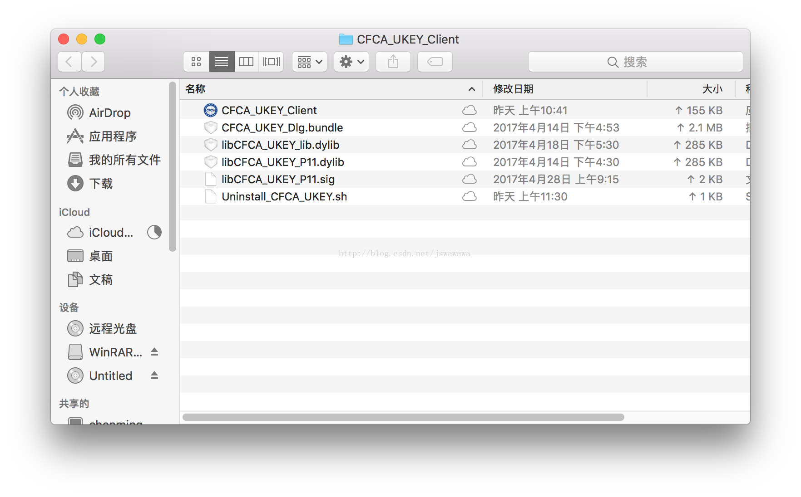
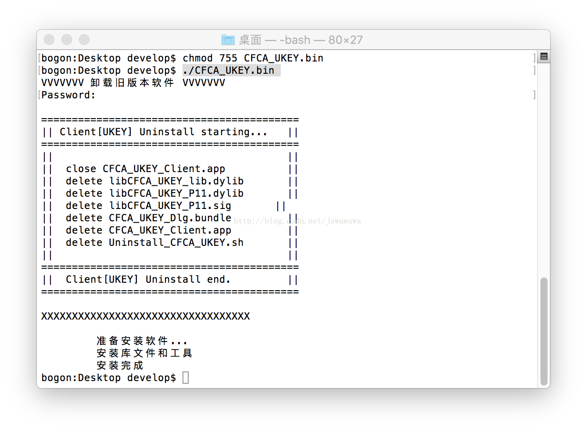

# 安装调研说明

最近研究了一下其他开源软件，发现一般提供以下几种安装方式：

* RPM包安装
* BIN文件安装
* tar.gz安装
* 直接提供docker镜像

## Linux 下RPM打包制作流程

RPM包制作最主要的是编写SPEC文件，SPEC文件里面定义安装目录，安装命令，安装脚本等信息，使用`rpmbuild`命令生成RPM包。

### 开始前的准备

安装rpmbuild软件包

yum -y install rpm-build
生成相关目录

要生成rpm相关目录，可以手动创建，也可以通过`rpmbuild`命令创建。如：

```$xslt
[root@yang data]# rpmbuild zabbix_agentd_ops.spec 
error: File /root/rpmbuild/SOURCES/zabbix-3.0.3.tar.gz: No such file or directory

有报错，无需理会，可以看到rpmbuild目录已经创建完成

[root@yang ~]# tree rpmbuild/
rpmbuild/
├── BUILD
├── BUILDROOT
├── RPMS
├── SOURCES
├── SPECS
└── SRPMS
```

### 编写SPEC文件

#### SPEC关键字

Name: 软件包的名称，后面可使用%{name}的方式引用

Summary: 软件包的内容概要

Version: 软件的实际版本号，例如：1.0.1等，后面可使用%{version}引用

Release: 发布序列号，例如：1linuxing等，标明第几次打包，后面可使用%{release}引用

Group: 软件分组，建议使用标准分组

License: 软件授权方式，通常就是GPL

Source: 源代码包，可以带多个用Source1、Source2等源，后面也可以用%{source1}、%{source2}引用

BuildRoot: 这个是安装或编译时使用的“虚拟目录”，考虑到多用户的环境，一般定义为：%{tmppath}/{name}-%{version}-%{release}-root或%{tmppath}/%{name}-%{version}-%{release}-buildroot-%%__id_u} -n}.该参数非常重要，因为在生成rpm的过程中，执行make install时就会把软件安装到上述的路径中，在打包的时候，同样依赖“虚拟目录”为“根目录”进行操作。后面可使用$RPM_BUILD_ROOT 方式引用。

URL: 软件的主页

Vendor: 发行商或打包组织的信息，例如RedFlag Co,Ltd

Disstribution: 发行版标识

Patch: 补丁源码，可使用Patch1、Patch2等标识多个补丁，使用%patch0或%{patch0}引用

Prefix: %{_prefix} 这个主要是为了解决今后安装rpm包时，并不一定把软件安装到rpm中打包的目录的情况。这样，必须在这里定义该标识，并在编写%install脚本的时候引用，才能实现rpm安装时重新指定位置的功能

Prefix: %{sysconfdir} 这个原因和上面的一样，但由于%{prefix}指/usr，而对于其他的文件，例如/etc下的配置文件，则需要用%{_sysconfdir}标识

Build Arch: 指编译的目标处理器架构，noarch标识不指定，但通常都是以/usr/lib/rpm/marcros中的内容为默认值

Requires: 该rpm包所依赖的软件包名称，可以用>=或<=表示大于或小于某一特定版本，例如：libpng-devel >= 1.0.20 zlib ※“>=”号两边需用空格隔开，而不同软件名称也用空格分开,还有例如PreReq、Requires(pre)、Requires(post)、Requires(preun)、Requires(postun)、BuildRequires等都是针对不同阶段的依赖指定

Provides: 指明本软件一些特定的功能，以便其他rpm识别

Packager: 打包者的信息

%description 软件的详细说明

#### SPEC脚本主体

%prep 预处理脚本

%setup -n %{name}-%{version}** 把源码包解压并放好通常是从/usr/src/asianux/SOURCES里的包解压到/usr/src/asianux/BUILD/%{name}-%{version}中。一般用%setup -c就可以了，但有两种情况：一就是同时编译多个源码包，二就是源码的tar包的名称与解压出来的目录不一致，此时，就需要使用-n参数指定一下了。

%patch 打补丁通常补丁都会一起在源码tar.gz包中，或放到SOURCES目录下。一般参数为：

%patch -p1 使用前面定义的Patch补丁进行，-p1是忽略patch的第一层目

%Patch2 -p1 -b xxx.patch 打上指定的补丁，-b是指生成备份文件

补充

%setup 不加任何选项，仅将软件包打开。 
%setup -n newdir 将软件包解压在newdir目录。 
%setup -c 解压缩之前先产生目录。 
%setup -b num 将第num个source文件解压缩。 
%setup -T 不使用default的解压缩操作。 
%setup -T -b 0 将第0个源代码文件解压缩。 
%setup -c -n newdir 指定目录名称newdir，并在此目录产生rpm套件。 
%patch 最简单的补丁方式，自动指定patch level。 
%patch 0 使用第0个补丁文件，相当于%patch ?p 0。 
%patch -s 不显示打补丁时的信息。 
%patch -T 将所有打补丁时产生的输出文件删除。
%configure 这个不是关键字，而是rpm定义的标准宏命令。意思是执行源代码的configure配置，在/usr/src/asianux/BUILD/%{name}-%{version}目录中进行 ，使用标准写法，会引用/usr/lib/rpm/marcros中定义的参数。另一种不标准的写法是，可参考源码中的参数自定义，例如：
```$xslt
引用CFLAGS="$RPM_OPT_FLAGS" CXXFLAGS="$RPM_OPT_FLAGS" ./configure --prefix=%{_prefix}
```

%build 开始构建包，在/usr/src/asianux/BUILD/%{name}-%{version}目录中进行make的工作

%install 开始把软件安装到虚拟的根目录中.在/usr/src/asianux/BUILD/%{name}-%{version}目录中进行make install的操作。这个很重要，因为如果这里的路径不对的话，则下面%file中寻找文件的时候就会失败。 常见内容有：

%makeinstall 这不是关键字，而是rpm定义的标准宏命令。也可以使用非标准写法：make DESTDIR=$RPM_BUILD_ROOT install或引用make prefix=$RPM_BUILD_ROOT install

需要说明的是，这里的%install主要就是为了后面的%file服务的。所以，还可以使用常规的系统命令：引用install -d $RPM_BUILD_ROOT/和cp -a * $RPM_BUILD_ROOT/

%clean 清理临时文件

%pre   rpm安装前执行的脚本

%post rpm安装后执行的脚本

%preun   rpm卸载前执行的脚本

%postun rpm卸载后执行的脚本

%files 定义那些文件或目录会放入rpm中

%defattr (-,root,root)** 指定包装文件的属性，分别是(mode,owner,group)，-表示默认值，对文本文件是0644，可执行文件是0755

%changelog  变更日志

实例：

```$xslt
%define zabbix_user zabbix                  #自定义宏，名字为zabbix_user值为zabbix,%{zabbix_user}引用
Name:   zabbix                              #软件包的名字，后面可用%{name}引用
Version:    3.0.3                           #软件的实际版本号，可使用%{version}引用
Release:    1%{?dist}                       #发布序列号，标明第几次打包  
Summary:    zabbix_agentd                   #软件包内容概要

Group:      zabbix                          #软件包分组
License:    GPL                             #授权许可方式
URL:        www.yang.com                    #软件的主页
Source0:    zabbix-3.0.3.tar.gz             #源代码包，可以有Source0,Source1等源

BuildRequires:      gcc, gcc-c++            #制作rpm包时，所依赖的基本库
Requires:   gcc, gcc-c++, chkconfig         #安装rpm包时，所依赖的软件包

%description                                #定义rpm包的描述信息
Zabbix agentd 3.0.3

%pre                                        #rpm包安装前执行的脚本
grep zabbix /etc/passwd > /dev/null
if [ $? != 0 ] 
then useradd zabbix -M -s /sbin/nologin
fi
[ -d /etc/zabbix   ]||rm -rf /etc/zabbix*


%post                                       #rpm包安装后执行的脚本
sed -i "/^ServerActive=/c\ServerActive=172.30.17.35" /etc/zabbix/etc/zabbix_agentd.conf
sed -i "/^Server=/c\Server=172.30.17.35" /etc/zabbix/etc/zabbix_agentd.conf
sed -i "/Timeout=3/c\Timeout=30" /etc/zabbix/etc/zabbix_agentd.conf
sed -i "/HostMetadata=/c\HostMetadata=PostgreSQL" /etc/zabbix/etc/zabbix_agentd.conf
sed -i "/^Hostname=/c\Hostname=PostgreSQL" /etc/zabbix/etc/zabbix_agentd.conf
echo "UnsafeUserParameters=1" >>/etc/zabbix/etc/zabbix_agentd.conf
echo "EnableRemoteCommands=1" >>/etc/zabbix/etc/zabbix_agentd.conf
echo "Include=/etc/zabbix/etc/zabbix_agentd.conf.d/*.conf" >>/etc/zabbix/etc/zabbix_agentd.conf
chkconfig zabbix_agentd on

%preun                                      #rpm卸载前执行的脚本
systemctl stop zabbix_agentd
%postun                                     #rpm卸载后执行的脚本
userdel  zabbix
rm -rf /etc/zabbix*
%prep                                       #这个宏开始
%setup -q                                   #解压并cd到相关目录


%build                                      #定义编译软件包时的操作
./configure --prefix=/etc/%{name}-%{version}   --enable-agent
make -j16 %{?_smp_mflags}

%install                                    #定义安装软件包，使用默认值即可
test -L %{buildroot}/etc/%{name} && rm -f %{buildroot}/etc/%{name}
install -d %{buildroot}/etc/profile.d
install -d %{buildroot}/etc/init.d
make install DESTDIR=%{buildroot}
echo 'export PATH=/etc/zabbix/bin:/etc/zabbix/sbin:$PATH' > %{buildroot}/etc/profile.d/%{name}.sh
ln -sf /etc/%{name}-%{version}          %{buildroot}/etc/%{name}
cp %{_buildrootdir}/postgresql.conf         %{buildroot}/etc/%{name}-%{version}/etc/zabbix_agentd.conf.d/postgresql.conf
cp %{_buildrootdir}/tcp_connections.sh      %{buildroot}/etc/%{name}-%{version}/etc/zabbix_agentd.conf.d/tcp_connections.sh
cp %{_buildrootdir}/iostat-collect.sh       %{buildroot}/etc/%{name}-%{version}/etc/zabbix_agentd.conf.d/iostat-collect.sh 
cp %{_buildrootdir}/iostat-parse.sh     %{buildroot}/etc/%{name}-%{version}/etc/zabbix_agentd.conf.d/iostat-parse.sh
cp %{_buildrootdir}/iostat-zabbix.conf      %{buildroot}/etc/%{name}-%{version}/etc/zabbix_agentd.conf.d/iostat-zabbix.conf 
cp %{_buildrootdir}/zabbix_agentd       %{buildroot}/etc/init.d/zabbix_agentd

%files                                      #定义rpm包安装时创建的相关目录及文件。在该选项中%defattr (-,root,root)一定要注意。它是指定安装文件的属性，分别是(mode,owner,group)，-表示默认值，对文本文件是0644，可执行文件是0755。
/etc/%{name}
/etc/%{name}-%{version}/*
/etc/init.d/zabbix_agentd
/etc/profile.d/%{name}.sh

%changelog                                  #主要用于软件的变更日志。该选项可有可无
%clean 
rm -rf %{buildroot}                         #清理临时文件
```

#### RPM包制作拓展

如果想为zabbix增加启动控制脚本或一些其他的配置文件，可以将其放在SOURCE下，然后复制过去

1.将启动脚本放在SOURCE目录
```
      [root@yang ~/rpmbuild/SOURCES]# ll
      total 15116
      -rwxr-xr-x 1 root root      362 Aug  1 12:03 hostmonitor.conf
      -rwxr-xr-x 1 root root      505 Aug  1 12:03 iostat-collect.sh
      -rwxr-xr-x 1 root root      953 Aug  1 12:03 iostat-parse.sh
      -rw-r--r-- 1 root root      772 Aug  1 12:03 iostat-zabbix.conf
      -rwxr-xr-x 1 root root      813 Aug  1 12:03 nginx_monitor.sh
      -rw-r--r-- 1 root root    14868 Aug  1 12:03 postgresql.conf
      -rw-r--r-- 1 root root       77 Aug  1 12:03 process.discovery
      -rw-r--r-- 1 root root      552 Aug  1 12:03 redis_check.conf
      -rw-r--r-- 1 root root      356 Aug  1 12:03 redis_cluster_check.py
      -rw-r--r-- 1 root root      363 Aug  1 12:03 redis_multiport_check.py
      -rwxr-xr-x 1 root root      783 Aug  1 12:03 tcp_connections.sh
      -rw-r--r-- 1 root root      852 Aug  1 12:03 userparameter_nginx.conf
      -rw-r--r-- 1 root root      172 Aug  1 12:03 userparameter_process.conf
      -rw-r--r-- 1 root root 15407273 Jul 20 10:53 zabbix-3.0.3.tar.gz
      -rwxr-xr-x 1 root root     2182 Aug  1 12:03 zabbix_agentd
```
2.编辑 SPEC文件
```$xslt
Source0下增加如下：
        Source0:        zabbix-3.0.3.tar.gz
        Source1:        zabbix_agentd
        Source2:        nginx_monitor.sh
        Source3:        userparameter_nginx.conf
        Source4:        hostmonitor.conf
        Source5:        process.discovery
        Source6:        userparameter_process.conf
        Source7:        redis_check.conf
        Source8:        redis_cluster_check.py
        Source9:        redis_multiport_check.py
        Source10:       tcp_connections.sh
        Source11:       iostat-collect.sh
        Source12:       iostat-parse.sh
        Source13:       iostat-zabbix.conf
```
3.安装区域增加如下行：
```$xslt
        make install DESTDIR=%{buildroot}
        install -p -D -m 0755 %{SOURCE1}        %{buildroot}/etc/init.d/zabbix_agentd
        install -p -D         %{SOURCE2}        %{buildroot}/etc/%{name}-%{version}/etc/zabbix_agentd.conf.d/nginx_monitor.sh
        install -p -D         %{SOURCE3}        %{buildroot}/etc/%{name}-%{version}/etc/zabbix_agentd.conf.d/userparameter_nginx.conf
        install -p -D         %{SOURCE4}        %{buildroot}/etc/nginx/conf.d/hostmonitor.conf
        install -p -D         %{SOURCE5}        %{buildroot}/etc/%{name}-%{version}/etc/zabbix_agentd.conf.d/process.discovery
        install -p -D         %{SOURCE6}        %{buildroot}/etc/%{name}-%{version}/etc/zabbix_agentd.conf.d/userparameter_process.conf
        install -p -D         %{SOURCE7}        %{buildroot}/etc/%{name}-%{version}/etc/zabbix_agentd.conf.d/redis_check.conf
        install -p -D         %{SOURCE8}        %{buildroot}/etc/%{name}-%{version}/etc/zabbix_agentd.conf.d/redis_cluster_check.py
        install -p -D         %{SOURCE9}        %{buildroot}/etc/%{name}-%{version}/etc/zabbix_agentd.conf.d/redis_multiport_check.py
        install -p -D         %{SOURCE10}       %{buildroot}/etc/%{name}-%{version}/etc/zabbix_agentd.conf.d/tcp_connections.sh
        install -p -D         %{SOURCE11}       %{buildroot}/etc/%{name}-%{version}/etc/zabbix_agentd.conf.d/iostat-collect.sh
        install -p -D         %{SOURCE12}       %{buildroot}/etc/%{name}-%{version}/etc/zabbix_agentd.conf.d/iostat-parse.sh
        install -p -D         %{SOURCE13}       %{buildroot}/etc/%{name}-%{version}/etc/zabbix_agentd.conf.d/iostat-zabbix.conf
```
4.%file区域增加如下行：
```$xslt
        %files
        %defattr (-,root,root,0755)
        /etc/%{name}
        /etc/%{name}-%{version}/*
        /etc/profile.d/%{name}.sh
        /etc/nginx/conf.d/hostmonitor.conf
        %attr(0755,root,root) /etc/rc.d/init.d/zabbix_agentd
```

以下为完整的SPEC文件：

```$xslt
Name:   zabbix
Version:    3.0.3     
Release:    1%{?dist}
Summary:    zabbix_agentd

Group:      zabbix
License:    GPL
URL:        www.yang.com
Source0:    zabbix-3.0.3.tar.gz
Source1:    zabbix_agentd
Source2:    nginx_monitor.sh
Source3:    userparameter_nginx.conf
Source4:    hostmonitor.conf
Source5:    process.discovery
Source6:    userparameter_process.conf
Source7:    redis_check.conf
Source8:    redis_cluster_check.py
Source9:    redis_multiport_check.py
Source10:   tcp_connections.sh
Source11:   iostat-collect.sh
Source12:   iostat-parse.sh
Source13:   iostat-zabbix.conf

BuildRequires:      gcc, gcc-c++
Requires:   gcc, gcc-c++, chkconfig

%description
Zabbix agentd 3.0.3

%pre
grep zabbix /etc/passwd > /dev/null
if [ $? != 0 ] 
then useradd zabbix -M -s /sbin/nologin
fi
[ -d /etc/zabbix   ]||rm -rf /etc/zabbix
[ -d /etc/zabbix   ]||rm -rf /etc/zabbix-3.0.3


%post
sed -i "/^ServerActive=/c\ServerActive=172.30.17." /etc/zabbix/etc/zabbix_agentd.conf
sed -i "/^Server=/c\Server=172.30.17." /etc/zabbix/etc/zabbix_agentd.conf
sed -i "/Timeout=3/c\Timeout=30" /etc/zabbix/etc/zabbix_agentd.conf
sed -i "/HostMetadata=/c\HostMetadata=OPS-TMP" /etc/zabbix/etc/zabbix_agentd.conf
sed -i "/^Hostname=/c\Hostname=OPS-TMP" /etc/zabbix/etc/zabbix_agentd.conf
echo "UnsafeUserParameters=1" >>/etc/zabbix/etc/zabbix_agentd.conf
echo "EnableRemoteCommands=1" >>/etc/zabbix/etc/zabbix_agentd.conf
echo "Include=/etc/zabbix/etc/zabbix_agentd.conf.d/*.conf" >>/etc/zabbix/etc/zabbix_agentd.conf
chkconfig zabbix_agentd on

%preun
systemctl stop zabbix_agentd
%postun
userdel  zabbix
rm -rf /etc/zabbix*
%prep
%setup -q


%build
./configure --prefix=/etc/%{name}-%{version}   --enable-agent
make -j16 %{?_smp_mflags}

%install
test -L %{buildroot}/etc/%{name} && rm -f %{buildroot}/etc/%{name}
install -d %{buildroot}/etc/profile.d
make install DESTDIR=%{buildroot}
install -p -D -m 0755 %{SOURCE1}    %{buildroot}/etc/init.d/zabbix_agentd
install -p -D         %{SOURCE2}    %{buildroot}/etc/%{name}-%{version}/etc/zabbix_agentd.conf.d/nginx_monitor.sh
install -p -D         %{SOURCE3}    %{buildroot}/etc/%{name}-%{version}/etc/zabbix_agentd.conf.d/userparameter_nginx.conf
install -p -D         %{SOURCE4}    %{buildroot}/etc/nginx/conf.d/hostmonitor.conf
install -p -D         %{SOURCE5}    %{buildroot}/etc/%{name}-%{version}/etc/zabbix_agentd.conf.d/process.discovery
install -p -D         %{SOURCE6}    %{buildroot}/etc/%{name}-%{version}/etc/zabbix_agentd.conf.d/userparameter_process.conf
install -p -D         %{SOURCE7}    %{buildroot}/etc/%{name}-%{version}/etc/zabbix_agentd.conf.d/redis_check.conf
install -p -D         %{SOURCE8}    %{buildroot}/etc/%{name}-%{version}/etc/zabbix_agentd.conf.d/redis_cluster_check.py
install -p -D         %{SOURCE9}    %{buildroot}/etc/%{name}-%{version}/etc/zabbix_agentd.conf.d/redis_multiport_check.py
install -p -D         %{SOURCE10}   %{buildroot}/etc/%{name}-%{version}/etc/zabbix_agentd.conf.d/tcp_connections.sh
install -p -D         %{SOURCE11}   %{buildroot}/etc/%{name}-%{version}/etc/zabbix_agentd.conf.d/iostat-collect.sh
install -p -D         %{SOURCE12}   %{buildroot}/etc/%{name}-%{version}/etc/zabbix_agentd.conf.d/iostat-parse.sh
install -p -D         %{SOURCE13}       %{buildroot}/etc/%{name}-%{version}/etc/zabbix_agentd.conf.d/iostat-zabbix.conf

echo 'export PATH=/etc/zabbix/bin:/etc/zabbix/sbin:$PATH' > %{buildroot}/etc/profile.d/%{name}.sh
ln -sf /etc/%{name}-%{version}          %{buildroot}/etc/%{name}

%files
%defattr (-,root,root,0755)
/etc/%{name}
/etc/%{name}-%{version}/*
/etc/profile.d/%{name}.sh
/etc/nginx/conf.d/hostmonitor.conf
%attr(0755,root,root) /etc/rc.d/init.d/zabbix_agentd
%changelog
%clean 
rm -rf %{buildroot}
```

------

## BIN文件安装

### 基本思想
制作简单的安装包的时候可以简单的用cat命令连接两个文件，然后头部是脚本文件，执行的时候把下面的文件分解出来就行了。一般这个后部分的文件是个压缩包，那样，就能够打包很多文件了，在脚本中解压出来即可。这就是Linux那些bin啊run啊等安装脚本的简单制作了。

两条比较关键的命令：

1. sed -n -e '1,/^exit 0$/!p' $0 > ${tmpfile_name} 2>/dev/null
2. tail -n $line $0 |tar x -C $tmpdir

都做了同一件事，将安装包从bin文件中分离出来。

### 制作步骤

#### 编写shell脚本

shell脚本主要有两个作用：

* 将压缩包从bin安装包中分离出来并解压
* 实现安装过程中需要进行的相关的文件操作（从压缩包中复制文件到系统指定路径下）

例：以下是安装脚本 CFCA_UKEY.sh，脚本中添加了必要的注释便于理解相关操作。

```bash
#!/bin/bash  
#安装前先卸载旧版本软件  
if [ -f "/usr/bin/Uninstall_CFCA_UKEY.sh" ];then  
    echo "VVVVVVV 卸载旧版本软件 VVVVVVV"  
    /usr/bin/Uninstall_CFCA_UKEY.sh  
    echo "XXXXXXXXXXXXXXXXXXXXXXXXXXXXXXXXXX"  
    echo ""  
fi  
  
#分离出的压缩包名称  
tmpfile_name=/tmp/CFCA_UKEY_Client.tgz  

echo -e "\t 准备安装软件..."  
#从bin中分离出${tmpfile_name}压缩包，'1,/^exit 0$/!p'代表从一行到以exit开头以0结尾的行即整个shell脚本，！代表取反，所以最后分离的是出了shell脚本的部分也即压缩包 $0代表脚本本身即从bin安装包中实现分离  
sed -n -e '1,/^exit 0$/!p' $0 > ${tmpfile_name} 2>/dev/null
  
#将分离出的脚本解压缩到/tmp文件夹下  
tar xzf ${tmpfile_name} -C /tmp  

#解压完成后删除压缩包  
rm -rf ${tmpfile_name}  

#转到解压文件的文件夹/tmp下  
cd /tmp  
  
####---- main ----####  
  
echo -e "\t 安装库文件和工具"  
#复制库文件以及管理工具到系统目录下（需要root权限，所以需要sudo执行）  
cp -r CFCA_UKEY_Client/CFCA_UKEY_Client.app /Applications  
cp -r CFCA_UKEY_Client/CFCA_UKEY_Dlg.bundle /Library/Bundles  
sudo cp CFCA_UKEY_Client/Uninstall_CFCA_UKEY.sh /usr/bin  
sudo cp CFCA_UKEY_Client/libCFCA_UKEY_*.* /usr/lib  

#安装过程完成后，删除解压后的文件目录  
rm -rf CFCA_UKEY_Client  
echo -e "\t 安装完成"  
exit 0  
```

以下是脚本Uninstall_CFCA_UKEY.sh ，实现在每次安装时对旧版本的文件进行删除卸载。（该脚本与bin安装包的制作无关）

```bash
#!/bin/bash  
name=UKEY  
sudo echo ""  
echo "=========================================="  
echo "|| Client[${name}] Uninstall starting...   ||"  
echo "=========================================="  
echo "||                                      ||"  
sudo ps -ax | grep CFCA_${name}_Client | awk '{print $1}' | xargs kill -9 > /dev/null 2>&1  
echo "||  close CFCA_${name}_Client.app          ||"  
sudo rm -rf /usr/lib/libCFCA_${name}_lib.dylib  
echo "||  delete libCFCA_${name}_lib.dylib       ||"  
sudo rm -rf /usr/lib/libCFCA_${name}_P11.dylib  
echo "||  delete libCFCA_${name}_P11.dylib       ||"  
sudo rm -rf /usr/lib/libCFCA_${name}_P11.sig  
echo "||  delete libCFCA_${name}_P11.sig       ||"  
sudo rm -rf /Library/Bundles/CFCA_${name}_Dlg.bundle  
echo "||  delete CFCA_${name}_Dlg.bundle         ||"  
sudo rm -rf /Applications/CFCA_${name}_Client.app  
echo "||  delete CFCA_${name}_Client.app         ||"  
sudo rm -rf /usr/bin/Uninstall_CFCA_${name}.sh  
echo "||  delete Uninstall_CFCA_${name}.sh       ||"  
echo "||                                      ||"  
echo "=========================================="  
echo "||  Client[${name}] Uninstall end.         ||"  
echo "=========================================="  
echo ""  
```

#### 打包所需文件

将脚本中文件操作相关的文件打包并压缩，之后将压缩包与脚本进行合并生成最终的bin安装包。

本例中所需打包的文件均已放在CFCA_UKEY_Client文件夹下，如下图所示：



在终端窗口运行指令：

tar -czvf CFCA_UKEY_Client.tgz CFCA_UKEY_Client/ 

对CFCA_UKEY_Client文件夹进行压缩生成压缩包CFCA_UKEY_Client.tgz


生成的bin安装包可以通过vi编辑器查看，可看到前半部分即为shell脚本，后半部分的乱码即为压缩包。脚本中语句`sed -n -e '1,/^exit 0$/!p' $0 > ${tmpfile_name} 2>/dev/null`即为实现分离出压缩包的功能。ps：随便拿到一个bin安装包，我们也可通过sed语句实现分离出其中的shell脚本以及压缩包：

从bin安装包中分离出shell脚本的指令：sed -n -e '1,/^exit 0$/p' bin安装包路径> 解压路径 2>/dev/null

从bin安装包中分离出压缩包的指令：sed -n -e '1,/^exit 0$/!p' bin安装包路径> 解压路径 2>/dev/null        (与上条指令的区别在于添加了sed中的取反符！)

#### 运行bin安装包

在终端窗口运行指令：

chmod 755 CFCA_UKEY.bin

给生成的bin安装包添加可执行权限，之后运行指令：

./CFCA_UKEY.bin

运行bin安装包，运行结果如下：



### PS：shell脚本借鉴

可以编写复杂的shell脚本实现更加复杂的安装，比较复杂的shell脚本借鉴如下：

```bash
#!/bin/bash  
  
if [ -f "/opt/uninstall.sh" ];then  
    echo "VVVVVVVV  卸载旧版本软件  VVVVVVVV"  
    /opt/uninstall.sh  
    echo "XXXXXXXXXXXXXXXXXXXXXXXXXXXXXXXXXX"  
    echo ""  
fi  
      
tmpfile_name=/tmp/icbc.tar.gz  
  
echo -e "\t 准备安装软件..."  
sed -n -e '1,/^exit 0$/!p' $0 > ${tmpfile_name} 2>/dev/null  
tar xzf ${tmpfile_name} -C /opt  
rm -rf ${tmpfile_name}  
cd /opt  
  
MountDisk()  
{  
        diskname=`fdisk -l | grep 'GB' | awk '$3 -ge 100' | awk '{print substr($2,1,8)}'`  
    
        if [ -z "$diskname" ];then  
                echo "没有可挂载的硬盘"  
                exit 0  
        fi  
  
        local filename="/etc/rc.d/rc.local"  
  
        tmpnum=`sed -n -e '/mount/=' ${filename}`  
        if [ -z "$tmpnum" ];then  
                echo "echo \"Starting Mount '$diskname',Please waiting...\" > /dev/tty1" >>$filename  
                echo "mount '$diskname' /opt/icbc/logs" >> $filename  
  
#       AllowPort 60000  
        fi  
  
        echo 'y' | mkfs.ext4 $diskname  
        mount $diskname /opt/icbc/logs  
}  
  
#usage: AllowPort port  
AllowPort()  
{  
    #防火墙允许通过  
    echo "开启端口号：" $1  
    /sbin/iptables -I INPUT -p tcp --dport $1 -j ACCEPT  
    /etc/init.d/iptables save  
    /etc/init.d/iptables restart  
}  
  
ConfigNetwork()  
{  
        local filename=/etc/sysconfig/network-scripts/ifcfg-eth0  
        tmpnum=`sed -n -e '/NM_CONTROLLED=yes/=' ${filename}`  
        if [ -n "$tmpnum" ];then  
                sed -i "/NM_CONTROLLED=yes/d" ${filename}  
        fi  
  
        tmpnum=`sed -n -e '/PEERDNS=yes/=' ${filename}`  
        if [ -n "$tmpnum" ];then  
                sed -i "/PEERDNS=yes/d" ${filename}  
        fi  
  
        tmpnum=`sed -n -e '/NM_CONTROLLED/=' ${filename}`  
        if [ -z "$tmpnum" ];then  
            echo "NM_CONTROLLED=no" >> ${filename}   
    fi  
  
        tmpnum=`sed -n -e '/PEERDNS/=' ${filename}`  
        if [ -z "$tmpnum" ];then  
            echo "PEERDNS=no" >> ${filename}   
    fi  
}  
          
InstallJRE()  
{  
    local filename=/etc/profile  
    tmpnum=`sed -n -e '/JAVA_HOME/=' ${filename}`  
    if [ -z "$tmpnum" ];then  
        #sed -i "/JAVA_HOME/d" ${filename}  
          
        echo "export JAVA_HOME=/opt/jre" >> ${filename}  
        echo "export CLASS_PATH=\$JAVA_HOME/lib" >> ${filename}  
        echo "export PATH=\$PATH:\$JAVA_HOME/bin" >> ${filename}  
    fi  
      
    source /etc/profile  
}  
  
InstallTomcat()  
{  
    local filename="/etc/rc.d/rc.local"  
      
    if [ ! -f "/etc/rc.d/init.d/tomcat" ];then  
#       echo "rm -ef /opt/tomcat/logs/*" >> $filename  
#       echo "rm -ef /opt/tomcat/work/*" >> $filename  
          
        cp /opt/tomcat/bin/tomcat /etc/rc.d/init.d  
        chkconfig --add tomcat  
          
        AllowPort 60002  
    fi  
      
    tmpnum=`ps -ef | grep tomcat | grep -v grep`  
    if [ -z "$tmpnum" ];then  
        #启动服务  
        service tomcat start  
    fi  
}  
  
InstallSbox()  
{  
    local filename="/etc/rc.d/rc.local"  
      
    tmpnum=`sed -n -e '/sbxmanager/=' ${filename}`  
    if [ -z "$tmpnum" ];then  
        echo "echo \"Starting Sbox Service,Please waiting...\" > /dev/tty1" >> $filename  
        echo "/opt/sbox/bin/sbxmanager.sh start &" >> $filename  
          
#       AllowPort 60000  
    fi  
      
    tmpnum=`ps -ef | grep managerd | grep -v grep`  
    if [ -z "$tmpnum" ];then  
        #启动服务  
        /opt/sbox/bin/sbxmanager.sh start  
    fi  
}  
  
InstallInitd()  
{  
        local filename="/etc/rc.d/rc.local"  
  
        tmpnum=`sed -n -e '/initd.jar/=' ${filename}`  
        if [ -z "$tmpnum" ];then  
                echo "echo \"Starting Proxy Service,Please waiting...\" > /dev/tty1" >> $filename  
                echo "/opt/jre/bin/java -Dfile.encoding=utf8 -jar /opt/icbc/initd/initd.jar &" >> $filename  
        fi  
}  
  
InstallJkgrd()  
{  
    local filename="/etc/rc.d/rc.local"  
      
    tmpnum=`sed -n -e '/jkmgrd/=' ${filename}`  
    if [ -z "$tmpnum" ];then  
        echo "echo \"Starting jkmgrd Service,Please waiting...\" > /dev/tty1" >> $filename  
        echo "jkmgrd p=60001 l=2" >> $filename  
          
        jkmgrd p=60001 l=2  
          
        AllowPort 60001  
    fi  
}  
  
StopFirewall()  
{  
    local filename="/etc/rc.d/rc.local"  
    tmpnum=`sed -n -e '/iptables/=' ${filename}`  
    if [ -z "$tmpnum" ];then  
        echo "echo \"Stopping firewall service, please waiting...\" > /dev/tty1" >> $filename  
        echo "service iptables stop" >> $filename  
    fi  
    service iptables stop  
}  
  
InstallJob()  
{  
    local filename="/var/spool/cron/root"  
      
    tmpnum=`sed -n -e '/submitLog/=' ${filename}`  
    if [ -z "$tmpnum" ];then  
        echo "0 0 * * * submitLog_Day.sh" >> $filename  
        echo "0 0 * * 1 submitLog_Week.sh" >> $filename  
        echo "0 0 1 * * submitLog_Month.sh" >> $filename  
    fi  
    tmpnum=`sed -n -e '/minisvs_rotate/=' ${filename}`  
        if [ -z "$tmpnum" ];then  
                echo "*/1 * * * * minisvs_rotate.sh" >> $filename  
        fi  
    tmpnum=`sed -n -e '/clean_log/=' ${filename}`  
        if [ -z "$tmpnum" ];then  
        echo "0 0 * * * clean_log.sh" >> $filename  
        fi  
}  
  
InstallNtpdate()  
{  
    local filename="/etc/rc.d/rc.local"  
    tmpnum=`sed -n -e '/ntpdate/=' ${filename}`  
    if [ -z "$tmpnum" ];then  
        echo "echo \"time update, please waiting...\" > /dev/tty1" >> $filename  
        echo "ntpdate cn.ntp.org.cn" >> $filename  
        echo "hwclock -w" >> $filename  
          
        ntpdate cn.ntp.org.cn  
    fi  
}  
  
StopSSH()  
{  
    local filename="/etc/rc.d/rc.local"  
      
    tmpnum=`sed -n -e '/killall sshd/=' ${filename}`  
    if [ -z "$tmpnum" ];then  
        echo "echo \"Close SSH Service,Please waiting...\" > /dev/tty1" >> $filename  
        echo "killall sshd" >> $filename  
    fi  
      
    tmpnum=`ps -ef | grep sshd | grep -v grep`  
    if [ -n "$tmpnum" ];then  
        echo "SSH serivce will close after 10 second"  
        sleep 10  
        killall sshd  
    fi  
}  
  
####---- main ----####  
  
echo -e "\t 挂载硬盘..."  
MountDisk  
  
echo -e "\t 配置网络..."  
ConfigNetwork  
  
echo -e "\t 修改启动列表默认时间"  
sed -i  's/timeout=5/timeout=0/' /boot/grub/menu.lst  
  
echo -e "\t 安装库文件和工具..."  
cp bin/ftp /usr/bin  
cp bin/ntpdate /usr/bin  
cp bin/jkmgrd /usr/bin  
cp bin/submitLog_*.sh /usr/bin  
cp bin/minisvs_rotate.sh /usr/bin  
rm -rf bin  
  
echo -e "\t 安装NTP时间同步..."  
InstallNtpdate  
  
echo -e "\t 安装Mysql..."  
cd mysql && ./install.sh  
  
echo -e "\t 安装JRE..."  
InstallJRE  
  
echo -e "\t 安装Tomcat..."  
InstallTomcat  
  
echo -e "\t 安装Sbox..."  
InstallSbox  
  
echo -e "\t 安装Jkmgrd..."  
InstallJkgrd  
  
echo -e "\t 安装Initd..."  
InstallInitd  
  
#echo -e "\t 关闭防火墙..."  
#StopFirewall  
  
echo -e "\t 开启日志上传计划..."  
InstallJob  
  
echo -e "\t 关闭SSH服务..."  
StopSSH  
  
```

## tar.gz安装

tar.gz安装即将所要安装的文件打包成tar.gz包，传输到目标机解压后执行目录中的脚本文件。

## docker镜像安装

使用docker file将软件做成镜像
